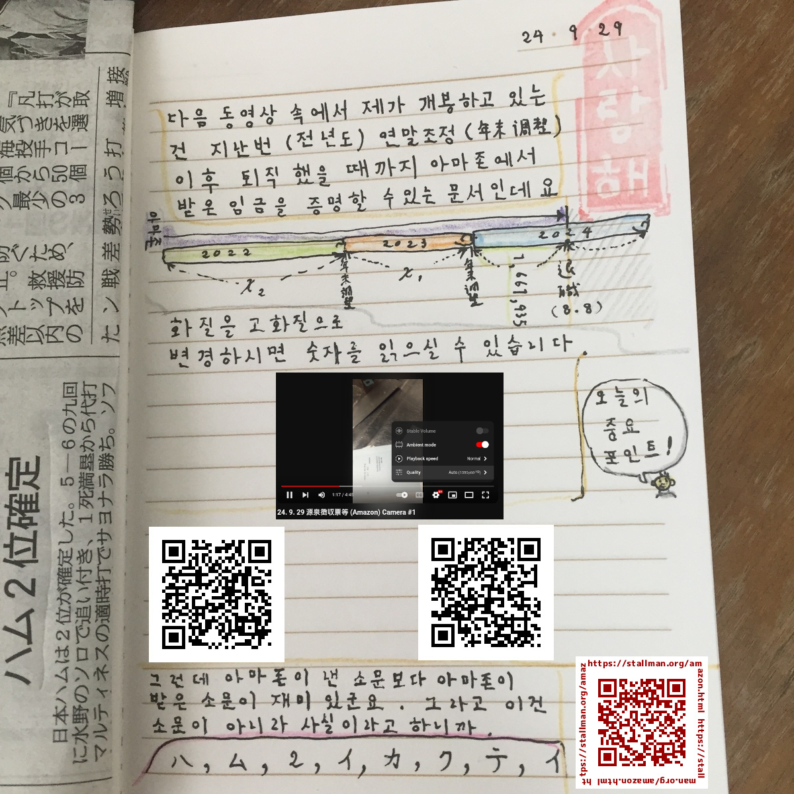
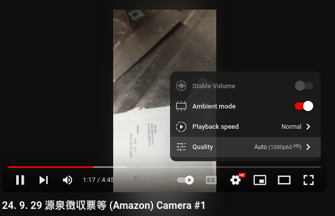

# extended-life

### :monkey: 
- これまでの経験から「登記情報提供サービスがメンテナンスにより利用不能となる日には暴走族などの訪問により街が騒がしくなり易い」ということが言えるのでここに本サービスのメンテナンス予定を転載します。私はカレンダー(高槻市から無料配布された健診日などが記載されたカレンダーです)のこれらのメンテナンス日のところに「monkey festa」と記入していますが、もしこれらの日に何らかの登記内容をご覧になる予定の方がおられたら日程変更をお願いします。(ちなみにこれらの日はいずれも法務局の休業日と重なってもいますので、1/11-1/13の期間中に登記事項証明書を請求するのは不可能です。郵送での取得を事前に申請してこの期間中に受け取ることは可能なのでGoogleで「登記ねっと」と検索してみて下さい)
  - 転載元: https://www1.touki.or.jp/news/1715_info.html

### Feb. 25, 2025 
- PS: こちらの方が画質が良いです。 
  - https://kangdaegae.web.fc2.com/misc/ipoint/2025/feb25-b1.mp4
  - https://kangdaegae.web.fc2.com/misc/ipoint/2025/feb25-b2.mp4
  - https://kangdaegae.web.fc2.com/misc/ipoint/2025/feb25-b3.mp4
- YouTube: 
  - https://youtube.com/shorts/FG5JO0_1GB4
  - https://youtube.com/shorts/0nSSJ-vvATI
  - https://youtube.com/shorts/JOkBYqsHfus
- 今朝の残高です: 
  - https://kangdaegae.web.fc2.com/misc/ipoint/2025/feb25-l1.mp4
  - https://kangdaegae.web.fc2.com/misc/ipoint/2025/feb25-l2.mp4
- YouTube: 
  - https://youtube.com/shorts/hMsQJhmT5nQ
  - https://youtube.com/shorts/DUuVNSrvysM

### Feb. 23, 2025 
- 給料日前残高です。 
  - https://kangdaegae.web.fc2.com/misc/ipoint/2025/feb23-l1.mp4
  - https://kangdaegae.web.fc2.com/misc/ipoint/2025/feb23-l2.mp4
- YouTube: 
  - https://youtube.com/shorts/fVeQPoq1uXk
  - https://youtube.com/shorts/fmJ4JNvQkQE

### Jan. 24, 2025 
- PS: こちらの方が画質が良いです。
  - https://kangdaegae.web.fc2.com/misc/ipoint/2025/jan24-b1.mp4
  - https://kangdaegae.web.fc2.com/misc/ipoint/2025/jan24-b2.mp4
  - https://kangdaegae.web.fc2.com/misc/ipoint/2025/jan24-b3.mp4
- 残りの作業は夕食後にします
  - https://youtube.com/shorts/I6CSCvBkpIw
  - https://youtube.com/shorts/vMiEc1Y9ky4
  - https://youtube.com/shorts/RxbwViJHWjw
- 今朝ローソンで行った残高照会の様子です。(今日は帰宅後も通帳動画アップロード等の作業を行いますので手紙を書くのがやや遅れるかと思います) 
  - カメラ1: 
    - https://youtube.com/shorts/Zq2p3L3mRRo
    - https://kangdaegae.web.fc2.com/misc/ipoint/2025/jan24-l1.mp4
  - カメラ2: 
    - https://youtube.com/shorts/7IHXP_TvIE4
    - https://kangdaegae.web.fc2.com/misc/ipoint/2025/jan24-l2.mp4

### Jan. 22, 2025 
- 給与支給日は24日(金)です。 
  - **Part one** 
    - YouTube: https://youtube.com/shorts/ItuV1cie6WA
    - https://kangdaegae.web.fc2.com/misc/ipoint/2025/jan22-l1.mp4
  - **Part two** 
    - YouTube: https://youtube.com/shorts/NGKEkRzBItQ
    - https://kangdaegae.web.fc2.com/misc/ipoint/2025/jan22-l2.mp4

### Jan. 3, 2025 
- 4 AM: 「毎年1月1日の新聞は、特集紙面や広告が多く掲載されており、普段の2～3倍ほどの厚い新聞になります。このページをご覧になる方も目立って増加し、紙離れの今でも人気があるようです。新聞のページ数が増えるために、ここに掲載されている値段より高い特別定価が設定されることもあります。店頭でご確認ください」 
  - https://westantenna.com/%E6%96%B0%E8%81%9E/141/

### Dec. 25 
- PS: こちらの方が画質が良いです。
  - https://kangdaegae.web.fc2.com/misc/ipoint/2024/dec25-b1.mp4
  - https://kangdaegae.web.fc2.com/misc/ipoint/2024/dec25-b2.mp4
  - https://kangdaegae.web.fc2.com/misc/ipoint/2024/dec25-b3.mp4
- 先にYouTubeにアップロードしました。夕食後Ujutubeにもアップロードします。
  - https://youtube.com/shorts/gSZlPaoewkY
  - https://youtube.com/shorts/SAYBWVjVYzA
  - https://youtube.com/shorts/ZnYwCGc7nmQ
- 今朝ローソンにて撮影したものです。
  - https://kangdaegae.web.fc2.com/misc/ipoint/2024/dec25-l1.mp4
  - https://kangdaegae.web.fc2.com/misc/ipoint/2024/dec25-l2.mp4
  - YouTube: 
    - https://youtube.com/shorts/jOAUN85cxn4
    - https://youtube.com/shorts/VzIkHvCgIQ0

### Dec. 14 
- 今朝ローソンにて市民税の支払いに必要な現金の引き出し 及び 支払いを行った際に下記の動画を撮影しましたので掲示します。引き出しと支払いそれぞれにおいて2つのカメラを用いて同時に撮影しています。
  - ( 現金の引き出し ) 
    - https://kangdaegae.web.fc2.com/misc/ipoint/2024/tax1-1.mp4
    - https://kangdaegae.web.fc2.com/misc/ipoint/2024/tax1-2.mp4
  - ( 支払い ) 
    - https://kangdaegae.web.fc2.com/misc/ipoint/2024/tax2-1.mp4
    - https://kangdaegae.web.fc2.com/misc/ipoint/2024/tax2-2.mp4
- YouTubeにもアップロードしました。
  - ( 現金の引き出し ) 
    - https://youtube.com/shorts/QhRHfo5OkBw
    - https://youtube.com/shorts/q0PuvmYQtns
  - ( 支払い ) 
    - https://youtube.com/shorts/AyZoihjICZo
    - https://youtube.com/shorts/ZvsVdHk0Xyo

### Nov. 27 
- 下記は今日郵便箱から回収した国民健康保険料還付(充当)通知書を撮影したものです。
  - *下記は容量確保のためいずれ削除します* 
    - https://kangdaegae.web.fc2.com/misc/ipoint/2024/nov27-m.mp4
  - YouTube: 
    - https://youtube.com/shorts/ym6PVjXBIWw

### Nov. 25 
- **NOTE:** I'll delete these soon so please download them now.  
- https://kangdaegae.web.fc2.com/misc/ipoint/2024/nov25-b1.mp4
- https://kangdaegae.web.fc2.com/misc/ipoint/2024/nov25-b2.mp4
- https://kangdaegae.web.fc2.com/misc/ipoint/2024/nov25-b3.mp4

- YouTube:
  - https://youtube.com/shorts/0Io2vaztr50
  - https://youtube.com/shorts/dDaugNKpl_U
  - https://youtube.com/shorts/iMTssISWuTw

### Oct. 25 
- **UPDATE:** SMBC Takatsuki Branch:
  - https://youtu.be/vTLM1lqbKtQ
  - https://youtu.be/ILoC23bZ2xk
  - https://youtu.be/PYWRDm37_CQ
- 下記の通り振り込まれていました。(約14万円の支給と、家賃約4.5万円の引落し)銀行へは退勤後一旦帰宅した後に行きます。
  - https://youtu.be/ZidL8laUq50
  - https://youtu.be/PF2iETa8HI0

### Oct. 24 
- 既にお伝えしたように明日25日が給料日ですが、10日締めである関係で明日支給されるのは1ヶ月の満額ではありません。(私が直雇用となったのは先月23日です)また明日は家賃の引き落としもありますので、残高はその分減るということを先にお伝えしておきます。現在働いているところがアマゾンのように日付が変わると同時に給与が振り込まれる仕組みを導入されているか定かではないので(一応早朝にコンビニATMで残高を見てみますが)それも念頭に置いておいて下さい。 

### Oct. 5 
PS: 今日どんな噂が流れていたか分かりませんが、私が遭遇した変わった出来事といえば下記の一件のみでした。

今朝コノミヤ高槻店でプリペイドカードのチャージをしようと入口付近にあるチャージ機の前に向かったのですが、店内側の自動ドアから中年の女性が急に出て来られ左側のチャージ機にて操作を始められました。

右側のチャージ機は使用可能な状態だったのですが、私はそれを使うことはなく左側のチャージ機を操作されている中年女性の後ろに並ぶことにしました。というのは今でもそうなのかは分かりませんが、この店にある二台のチャージ機のうち左側のはチャージ時のレシートに「コノミヤ高槻店」と印字されるにも関わらず、右側のではなぜか「コノミヤセンター４」とかいう印字がなされるのを知っていたからです。

すると入口側から別の中年女性が来られ、この方もチャージをされるご様子でしたが右側のチャージ機を指しながら私に「どうぞ」と仰っしゃりました。私はいえいえどうぞ、とか言いながら時間を稼いでいましたがじきに先の女性がチャージを終えられたので左側の(「コノミヤ高槻店」の)チャージ機でチャージを行いました。その間後で来られた女性は右側の(「コノミヤセンター４」の)チャージ機でチャージをされていましたが、その後この方が私が持つ買い物かごの内容をちらちらと見ているような気がしました。

皆様が毎日信じさせられている噂の大半が「未来予想」系のものだと思います。こういった未来予測がしばしば外れる背景にはこのようなドラマ(?)があるということを半信半疑でもよいので覚えておいて頂けると幸いです。

---- 

皆様がどのような方法で噂に接するのか分かりませんが(口コミやSNS等が考えられますが)、確実に言えるのは点である個人が毎回噂を流しているならその噂は広まらず、長く続かないだろうということです。噂が外れる度に発信者に対する信用が薄れ、皆様もその方からの情報を以降無視するようになるだろうからです。

ただもし仮に、周囲の人々が一斉に同じ噂を信じるような状況が起こったらどうなりますか？皆様も半信半疑でもとりあえずはその輪に加わろうとするでしょう。このようにして一人分広がった輪をご覧になった他の方々もそれにつられてどんどん加入して行き、輪は大きくなっていくかも知れませんね。

この辺については私もよく理解出来ていませんが、仮にそういった輪を日本中でいくつも同時多発的に出現させることが出来ればその後の連鎖反応も含めてとてつもなく多くの人々を噂に巻き込むことが出来るのではないでしょうか。

ただそんなことはまず日本中に協力者がいなければ出来ませんね。無数の協力者がいつどういった噂を流すかを決めて、同時に実行するのでなければそんなことは不可能です。(その人々はそのように事前に協議した噂をあたかも関係ない知人から聞いたかのように皆様に話すことでしょう) 

### Sep. 29 
PS: 源泉徴収票は年のはじめに前年の年末調整の結果に基づいて発行されますが、私のように年の途中で退職した場合、退職時点までの所得に基づいて(年末調整を待たずして)発行されます。

最近攻撃してくるのは主婦の方ばかりですが、私はそれにいつも感謝しています。というのは日本の専業主婦が知らないようなことは韓国の一般人もご存知でない可能性が高いからです。

最近でも10日締め25日払いのこととか(私は締日の後に入社しましたから今月25日には給与は支払われませんね)、タイミーのような日雇い労働システムのこととかがそれに該当しますが、こういったことについて逐一説明を行っていなかったら彼女にも大きな誤解を抱かれていたかも知れません。

- 

ちなみに皆様が想像なさったようなことについては既に対策を打っています。以前書いた下記の文章をお読み下さい。

> 現在流れている噂がこれかは分かりませんが、下記に私がアマゾンの社内ネットワーク上で初めて書いたコメントがありますからアマゾンの社員の皆様はご覧になってみて下さい。 (書込みは数個あります。あと時刻表記がUTCであり日本時間でないことに注意)
> 
> https://w.amazon.com/bin/view/Associate2Tech
> 
> まだ削除されていなければhirosukによる最も古いコメントは数年前の"Hi. Will this program be available in..."で始まるものだと分かるはずです。
> 
> 私が知る限り一度退職した者が再雇用された場合、新規にログインIDが割り当てられるはずです。また下記のページにある通り退職してから再応募可能になるまでには一定の待機期間が必要です。(下記の場合6ヶ月)
> 
> https://amazon.co.jp/rafjp
> 
> 数年前に私が解雇されたという噂を流した方々が自己防衛のための噂を流した可能性もありますが、いずればれることなのでいい加減にした方が本当に身のためだと思います。

---- 

- アマゾンが給与関連の業務を委託しているペイロールから送られてきた源泉徴収票等を撮影したものです。
  - https://youtu.be/uBcAHuonuxo
  - https://youtu.be/PkxYCIHsrug
- ※下記のように再生画質をHDに設定すると小さな文字も判別出来るかと思います。
  - 

### Sep. 28 
- YouTube: 
  - https://youtu.be/nAInXMxYgas
  - https://youtube.com/shorts/7sByH_K-IcU
- これらの動画は来月の頭には削除します。(サーバ容量確保のため)
- 関西みらい銀行 高槻支店
  - https://kangdaegae.web.fc2.com/misc/ipoint/2024/sep28-bk1.mp4
  - https://kangdaegae.web.fc2.com/misc/ipoint/2024/sep28-bk2.mp4
- (SMBC口座への転送) 
  - https://kangdaegae.web.fc2.com/misc/ipoint/2024/sep28-bkt.mp4
- ゆうちょ銀行 (支店名は分かりませんが高槻センター街の近くです) 
  - https://kangdaegae.web.fc2.com/misc/ipoint/2024/sep28-by1.mp4
  - https://kangdaegae.web.fc2.com/misc/ipoint/2024/sep28-by2.mp4
- 三井住友銀行 高槻支店 
  - https://kangdaegae.web.fc2.com/misc/ipoint/2024/sep28-bs1.mp4
  - https://kangdaegae.web.fc2.com/misc/ipoint/2024/sep28-bs2.mp4

もしかすると私がアマゾン退職直後に書いた「(9月の)チュソクは過ごせるだろうが、ハングラル(ハングルの日; 10月9日)頃には死が実感出来ているだろう」という予測がもとで今世間で何らかの噂が流れているのかも知れません。

ただこの予測は私を雇う会社がないという思い込みに基づいており不正確であったばかりか、当時「最後時の家財撤去費用」に充てるとしていた他口座の残高も正確に把握出来ていませんでした。またタイミーやフルキャストによる日雇いの仕事をしたことにより、計約10万円の収入が発生しました。

これまではフルキャスト経由での日雇いでしたので「即給」というシステムが利用できていたのですが、9月23日からの労働分については10日締めの25日払いになりますから初回の給料日は10月25日になるかと思います。(翌月払いであれば11月25日ですが) 

初回の給与が支給されるまでの間、メイン口座の残高が少なくなり彼女が心配されるかも知れませんので、今日か明日かなり以前に使用していて放置状態になっている口座(関西アーバン)をまだ可能であれば記帳してみて、いくらかメインの方に転送しようかと考えています。(ちなみにこの関西アーバンのは当初「最後時の家財撤去費用」に用いると述べていたのとは別の口座です) 

### Sep. 22 
- **Fキャストでの勤務分は今日記帳した分で最後となりますから次回は勤務先の給与支給日以降となります** 
- YouTube: 
  - https://youtu.be/8zr46yHN1tk
  - https://youtu.be/8YIWt6m53vE
- これらの動画は来月の頭には削除します。(サーバ容量確保のため) 
  - https://kangdaegae.web.fc2.com/misc/ipoint/2024/sep22-b1.mp4
  - https://kangdaegae.web.fc2.com/misc/ipoint/2024/sep22-b2.mp4

### Sep. 17 
- YouTube:
  - https://youtu.be/x760h2MLk_4
  - https://youtube.com/shorts/fO7sTfA6h1w
- これらの動画は来月の頭には削除します。(サーバ容量確保のため) 
  - https://kangdaegae.web.fc2.com/misc/ipoint/2024/sep17-b1.mp4
  - https://kangdaegae.web.fc2.com/misc/ipoint/2024/sep17-b2.mp4

### Sep. 12 
- a seminar held at HelloWork Ibaraki, on Sep. 12, 2024 
  - https://youtu.be/OaouqpR3ANU
- YouTube:
  - https://youtu.be/lUNBlD05YLY
  - https://youtube.com/shorts/QPWCl1aHVvU
- これらの動画は来月の頭には削除します。(サーバ容量確保のため) 
  - https://kangdaegae.web.fc2.com/misc/ipoint/2024/sep12-b1.mp4
  - https://kangdaegae.web.fc2.com/misc/ipoint/2024/sep12-b2.mp4

### Sep. 11 
- YouTube:
  - https://youtu.be/G76SAR7z0Eo
  - https://youtu.be/8xamlCo19zI
- これらの動画は来月の頭には削除します。
  - https://kangdaegae.web.fc2.com/misc/ipoint/2024/sep11-b1.mp4
  - https://kangdaegae.web.fc2.com/misc/ipoint/2024/sep11-b2.mp4
